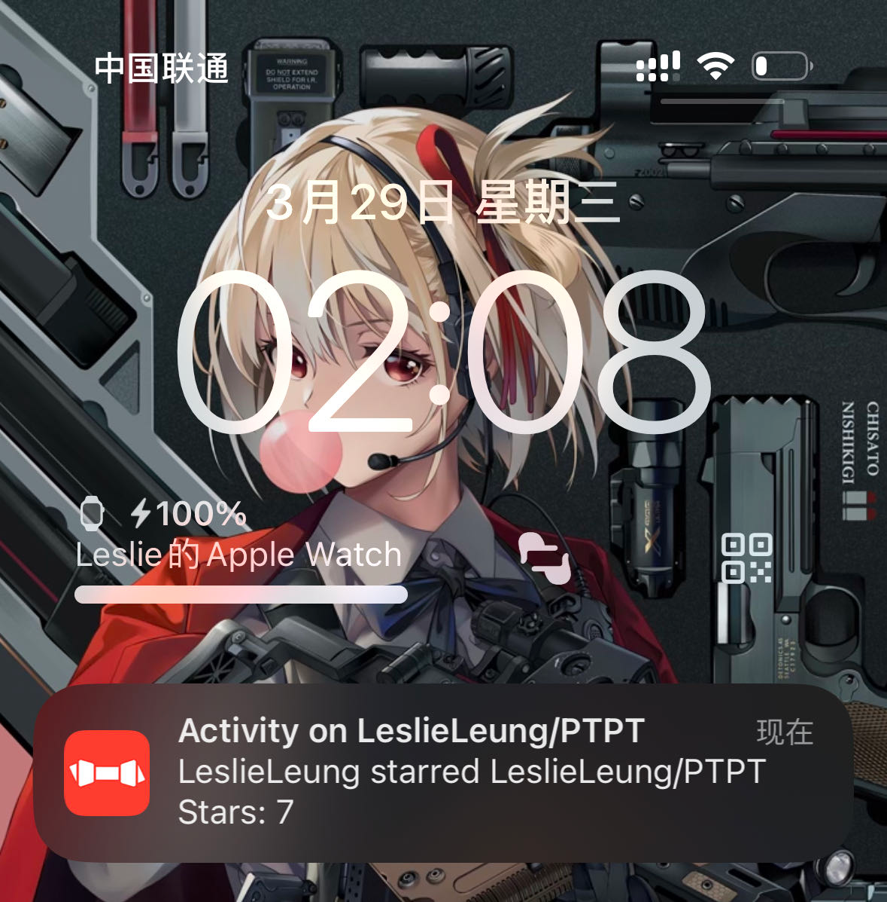

<h1>使用 Heimdallr 接收 GitHub star webhook</h1>

进入 GitHub 仓库的 Settings -> Webhooks -> Add webhook。

Payload URL 填入通知服务的地址，加上路径参数，其中 `{key}` 为通知渠道的 `token`。

```
https://example.com/webhook/github/star/{key}
```

Content type 选择 `application/json`， Secret 留空。

选择 Let me select individual events，勾选 Stars。

大功告成！

效果如下

